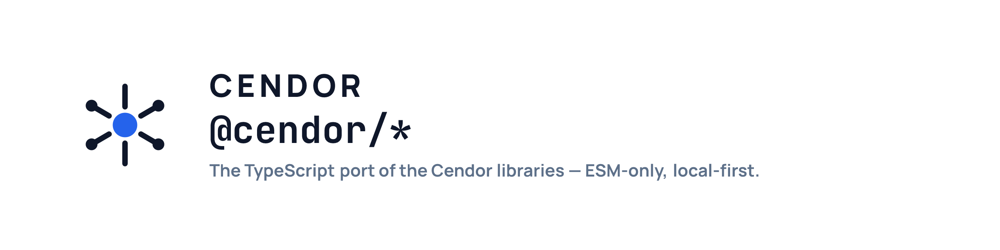
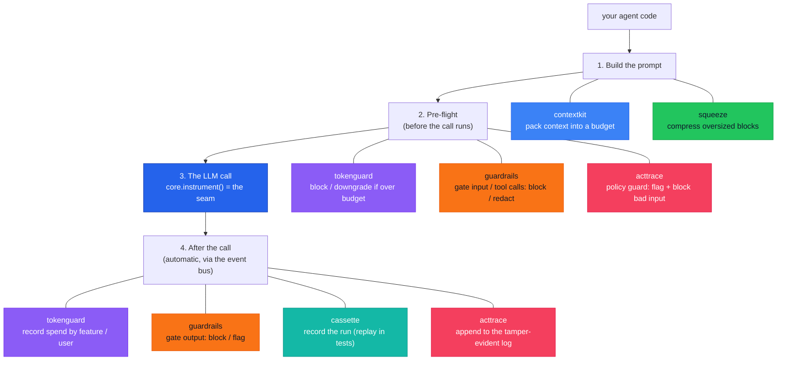

<p align="center">
  <picture>
    <source media="(prefers-color-scheme: dark)" srcset=".github/assets/cendor-libs-js-banner-dark.png">
    
  </picture>
</p>

**Production plumbing for LLM applications.**

Composable TypeScript primitives for context, cost, testing, and governance — the layer beneath your LLM app. The TypeScript/JavaScript port of the [Cendor libraries](https://github.com/cendorhq/cendor-libs).

[](https://www.npmjs.com/package/@cendor/libs)     [](https://biomejs.dev)

[**Install**](#install) · [**The libraries**](#the-libraries-in-depth) · [**See it compose**](#see-it-all-compose) · [**Docs**](https://cendor.ai/docs) · [**Parity matrix**](https://cendor.ai/docs/languages)

*framework-agnostic · ESM-only · local-first · offline by default*

> These are the `@cendor/*` npm packages — **one implementation** of the cross-language
> [format specs](https://github.com/cendorhq/cendor-libs/tree/main/docs/specs). A cassette recorded
> in Python replays here; an audit chain written here verifies in Python. **Byte-for-byte.**

---

## The problem

You shipped an LLM agent. Then production happened:

- 🧠 **Prompts overflow the context window** — and naive truncation drops exactly the wrong things.
- 💸 **Cost is a black box** — a looping agent quietly burns real money, and you can't say which feature or user spent it.
- 🧪 **You can't test it** — every run hits a paid, non-deterministic API, so there are no fast, repeatable tests.
- 📋 **There's no audit trail** — when something goes wrong (or a regulator asks), you can't show what the agent saw, did, cost, or *refused to do*.

Agent frameworks (LangChain.js, the Vercel AI SDK, the provider SDKs) decide *what* your agent does.
They don't handle these cross-cutting, *under-the-call* concerns. **Cendor does — and you keep your
framework.**

## The fix: wrap your client once, every tool plugs in

```ts
import OpenAI from 'openai';
import { instrument } from '@cendor/core';

const client = instrument(new OpenAI());   // ← the one line you change
```

That single wrap publishes every LLM and tool call onto an in-process **event bus**. Each library
*subscribes* — none patches your client, none imports another — so you add budgeting, recording, or
auditing with **zero per-call wiring**.



Read it top to bottom — that's one request's lifecycle, with each library labelled **where it acts**.
Note that **tokenguard**, **guardrails**, and **acttrace** each appear twice: they run *before* the
call (cap spend / gate the input / guard bad input) **and** *after* it (record cost / gate the output
/ append to the log).

## The seven libraries — at a glance

Each solves one production problem, and each works **on its own**:

| Package | mirrors (Python) | Solves | In one line |
|---|---|---|---|
| [**@cendor/contextkit**](packages/contextkit) | `cendor.contextkit` | prompts overflow | Pack prioritized blocks into a token budget, evict by rule, and get a receipt of what was kept, shrunk, or dropped. |
| [**@cendor/squeeze**](packages/squeeze) | `cendor.squeeze` | a blob is too big | Content-aware, deterministic compression (JSON/logs/code/prose) — fully reversible, byte-for-byte. |
| [**@cendor/tokenguard**](packages/tokenguard) | `cendor.tokenguard` | runaway cost | Cap spend before a call runs (block/downgrade), and attribute cost per feature/user. |
| [**@cendor/guardrails**](packages/guardrails) | `cendor.guardrails` | unsafe in/out | A deterministic gate — block, redact, or flag by keyword/regex/URL/length/JSON-schema at four stages, before the model or a tool runs. |
| [**@cendor/cassette**](packages/cassette) | `cendor.cassette` | can't test agents | Record a whole run once (LLM + tool calls), replay it forever — offline, deterministic. |
| [**@cendor/acttrace**](packages/acttrace) | `cendor.acttrace` | no audit trail | Pre-send guard for secrets & PII (block / redact) **and** a tamper-evident, offline-verifiable decision log with compliance evidence packs. |
| [**@cendor/core**](packages/core) | `cendor.core` | the shared glue | Types, token counting, offline prices, the `instrument()` seam, and the event bus every tool rides. |
| [**@cendor/libs**](packages/libs) | `cendor-libs` | one install | Umbrella meta-package — all seven in a single dependency. |

Read that as **one call's lifecycle, not a dependency chain** — assemble and compress the prompt,
budget and gate before send, then test, re-gate the output, guard, and audit after — every library
standalone, all cooperating on `@cendor/core`'s bus.

All are **published on npm** and green in CI (offline tests · Biome · `tsc`).

## Proof — cross-language, deterministic, offline

The port's headline claim is *interoperability*: every artifact is byte-identical to the Python
reference, checked by committed conformance vectors in both CIs — each language verifies artifacts
written by the other. No network, no API keys.

| What | Verifiable claim |
|---|---|
| Token counting (`js-tiktoken`) | **exact** tiktoken numbers for the mapped OpenAI families (gpt-4o / gpt-4.1 / o-series) — the same counts as Python's `tiktoken`; gpt-5.x counts via the o200k BPE proxy until a mapping ships |
| Money | **decimal, never an IEEE float** — `decimal.js` mirroring Python's `Decimal`; compared by exact value |
| Cassette replay | a **Python-recorded cassette replays in JS** (and vice-versa) — same request hashes, same `cassette/2` file |
| Audit chain | a **JS-written hash chain `verify()`s in Python** — identical canonical bytes + HMAC inputs |
| Tamper detection (acttrace) | a **single edited byte** breaks the chain → `verify()` returns `[false, …]` |
| squeeze | **100% reversible** — `handle.expand()` restores the original byte-for-byte, no matter how hard you squeeze |

See the [parity matrix](https://cendor.ai/docs/languages) for the full capability map and the
[`fixtures/`](fixtures) directory for the golden vectors.

## Install

```bash
npm i @cendor/libs                       # the whole stack (all seven)
npm i @cendor/core @cendor/tokenguard    # or just the pieces you need (core comes transitively)
```

Provider SDKs (`openai`, `@anthropic-ai/sdk`, …) are **optional peers** — install only the ones you
call. Everything is ESM-only and ships its own types.

## Quickstart — offline, no API key

Token counting and pricing ship offline, so this runs with zero network:

```ts
import { tokens, prices } from '@cendor/core';

const msgs = [{ role: 'user', content: 'Summarize this quarterly report in 3 bullets.' }];
const n = tokens.count(msgs, 'gpt-4o');
console.log(n, 'tokens →', prices.estimate('gpt-4o', n, { outputTokens: 200 }).toString()); // exact decimal cost
```

Wrap a real client and every call reports exact tokens + Decimal cost — with nothing else wired:

```ts
import OpenAI from 'openai';
import { instrument, bus, LLMCall } from '@cendor/core';

const client = instrument(new OpenAI());
bus.subscribe((e) => {
  if (e instanceof LLMCall) console.log(e.model, e.usage?.totalTokens, e.cost?.toString());
});
await client.chat.completions.create({ model: 'gpt-4o', messages: msgs });
```

---

## The libraries in depth

### 🧠 @cendor/contextkit — assemble context to a budget

> Treat the context window like a packed suitcase, not a string you concatenate.

- **Token-budgeted packing** — declare `Block`s with `priority` and `pin`; `assemble()` fits them into `budgetTokens` (minus `reserveOutput`), deterministically. Pinned blocks are never evicted (throws `BudgetError` if they alone overflow).
- **Per-block eviction** — `'drop_oldest'` · `'truncate'` (keep head/tail, with a `…[truncated]` marker) · `'summarize'` (via a `summarizer`, sync or async) · `'compress'` (via `@cendor/squeeze` — **reversible**: the decision surfaces a `handle`, so you can restore the original) · or **any custom `EvictionStrategy`**.
- **Real chat-history** — `new Block({ messages: [...] })` holds a conversation segment and peels the *oldest turns* to fit (a sliding window) — never mangling a turn.
- **An honest receipt** — `report()` returns an `AssemblyReport`: kept / shrunk / dropped per block, with token math. It's accurate at the **message level** (`used === tokens.count(await ctx.assemble(), model)`), charging the per-message framing providers add.
- **Attention-aware ordering** — `order: 'default'` · `'attention'` (lost-in-the-middle: strongest context on the edges) · `'cache'` (stable prefix to maximize prompt-cache hits).
- **Provider adapters** — `forAnthropic()` / `forGemini()` / `forBedrock()`; `whatif(budget)` previews a tighter budget without committing; `useCompressor()` swaps the compression backend.

```ts
import { Block, Context } from '@cendor/contextkit';

const ctx = new Context({ budgetTokens: 8000, model: 'gpt-4o', reserveOutput: 500, order: 'attention' });
ctx.add(new Block(SYSTEM_PROMPT, { role: 'system', priority: 100, pin: true }))
   .add(new Block({ messages: chatHistory, priority: 3, evict: 'drop_oldest' })); // peels oldest turns

const messages = await ctx.assemble();     // within budget, deterministic
console.log(ctx.report().toString());      // receipt: kept / shrunk / dropped + token math
```

### 🗜️ @cendor/squeeze — reversible, content-aware compression

> Shrink verbose context without throwing anything away.

- **Four purpose-built compressors** — **JSON** (minify + drop nulls; budget-shrink drops keys/elements *structurally*, staying valid JSON), **logs** (normalize timestamps/UUIDs/IPs/hex + dedup repeats into `(×N)`, chronological), **code** (strip comments — *string-aware*, so a `//` or `#` inside a literal survives; keeps preprocessor & shebang lines), **prose** (extractive sentence ranking). `detect()` auto-routes; `kind` overrides.
- **Compress to a budget** — `targetTokens` is **never exceeded**; `fidelity: 'lossless' | 'balanced' | 'aggressive'` trades structure for size. No LLM, no model download, deterministic.
- **100% reversible** — every original is kept in a **content-addressed store** (deduped by sha256), so `handle.expand()` restores it byte-for-byte no matter how hard you squeeze.
- **Survives restarts** — persist `handle.toDict()` next to a durable `SQLiteStore` (via optional `better-sqlite3`) and `Handle.fromDict(...).expand()` in the next process; or a bounded LRU `MemoryStore(maxItems)`.
- **Plugs into contextkit** by satisfying core's `Compressor` protocol — by shape, no import.

```ts
import { compress } from '@cendor/squeeze';

const [small, handle] = compress(hugeLogs, { kind: 'auto', targetTokens: 400 });   // up to ~99% on repetitive logs
const original = handle.expand();                                                  // byte-for-byte, anytime
```

### 💸 @cendor/tokenguard — budget + cost attribution

> Stop runaway bills, and get per-feature / per-user cost for free.

- **Pre-flight circuit breaker** — `onExceed: 'block'` throws `BudgetExceeded` **before** an over-budget call runs; `'downgrade'` reroutes to a cheaper model pre-flight (needs a `downgrade` map); `'clamp'` injects a provider output ceiling; `'truncate'` degrades gracefully; `'raise'` stops a runaway loop post-flight; or pass a **callable**.
- **Callback scope *and* decorator** — `withBudget(cfg, cb)` (parity of `with budget(...)`); `budget(cfg)(fn)` wraps a function with a fresh budget per call. Budgets **nest** and the tightest applicable cap wins.
- **Cost attribution, free** — `track(tags, cb)` tags ambient spend via `AsyncLocalStorage` (propagates across `await`); `report(groupBy)` aggregates per tag into a `Report` (`.rows`, `.total()`, iterable).
- **Cost as a test assertion** — `report().assertUnder(usd, tagFilter?)`.
- **Pre-flight projection** — `estimate(model, messages, maxOutputTokens?)` prices a call *without making it*.
- **Durable + bounded** — `useSink(SQLiteSink / QueueSink / OTelSink)` from `@cendor/tokenguard/sinks` persists each row; the in-memory buffer is FIFO-bounded (`configure({ maxRecords })`, `dropped()`).

```ts
import { withBudget, track, report, BudgetExceeded } from '@cendor/tokenguard';

await withBudget({ usd: 0.50, onExceed: 'block' }, () =>       // throws BEFORE an over-budget call runs
  track({ feature: 'support', user_id: 'alice' }, () =>
    client.chat.completions.create({ model: 'gpt-4o', messages })));

for (const row of report(['feature', 'user_id'])) console.log(row.tags, row.usd.toString(), row.calls);
```

### 🧪 @cendor/cassette — record once, replay forever

> The `vcrpy` of the agent era — except it captures the *whole run*.

- **Whole-run capture** — every LLM **and** tool call, in order (not just HTTP). The fixture layer beneath your eval platform.
- **Four modes** — `'auto'` (record if missing, else replay) · `'record'` · `'replay'` (fail on an unrecorded call) · `'rerecord'` (run live, report `drift()`, never overwrite the committed cassette).
- **Callback scope or decorator** — `using(path, opts, async () => …)` or `use(path)(fn)`.
- **Meaning-based assertions** — `semanticMatch(actual, expected, threshold?, scorer?)` (offline lexical default), with pluggable scorers (`cosine`, `embeddingScorer(embedFn)`, `openaiEmbeddingScorer`); `semanticDrift()` filters `rerecord` noise down to real regressions.
- **Pluggable matching + redaction** — a `normalizer` decides what makes two requests "the same"; secrets/PII are redacted on write, but matching hashes the **un-redacted** request so redaction never collapses two distinct calls.
- **Parallel-safe** — recording is `AsyncLocalStorage`-scoped, so concurrent `using()` blocks on the shared bus never cross-contaminate. `promote()` turns a JSONL production trace into a replayable regression test.

```ts
import { instrument } from '@cendor/core';
import { using } from '@cendor/cassette';

const client = instrument(openai);
const answer = await using('tests/fixtures/run.json', { mode: 'auto' }, async () => {   // records once, replays forever
  const resp = await client.chat.completions.create({ model: 'gpt-4o', messages });
  return resp.choices[0].message.content;
});
```

### 📋 @cendor/acttrace — tamper-evident audit & governance

> Evidence to *support* compliance — not a guarantee, not legal advice.

- **Auto-populating** — construct an `AuditLog` and it subscribes to the bus: every LLM/tool call, plus the cost (tokenguard) and context decisions (contextkit) riding the same stream, becomes an entry with no per-call wiring.
- **Tamper-evident hash chain** — `entry.hash = sha256(prev_hash + canonical(entry))`; `verify()` re-walks it offline and catches edits, reordering, **and tail-truncation**. Never throws — it returns `[ok, detail]`.
- **Optional HMAC signing** — `signingKey` proves the log came from a key-holder, not just that it's internally consistent.
- **Decisions & human oversight** — `log.decision(async (d) => …, { input })` groups a unit of work; `d.record({...})` and `d.humanOversight(reviewer, action)` capture Art. 14-style sign-off.
- **Offline detection engine + policy** — a validator-gated `Detector` registry of **20 categories** (secrets, PII, financial, government IDs, GDPR special-category), plus a `Policy` (`Policy.default/gdpr/pci/strict`). Regex + local checksums (Luhn / IBAN mod-97 / Verhoeff / ABA) — no model, no network. `scan()` / `redact()` work standalone; `guard(policy, audit)` wires enforcement onto core's interceptor seam.
- **Compliance evidence packs** — `log.export(path, framework)` annotates each entry with control IDs for **EU AI Act**, **GDPR**, **ISO/IEC 42001**, and **NIST AI RMF** (starting templates), and writes a signed `_meta` completeness header.
- **Regex/pattern detectors + optional NER** — 20 offline detectors and checksum validators by default; free-text names/places/orgs can also be redacted via the optional `compromise` peer dep (`nerRedactor()`, English-only, lighter than Python's Presidio — not full parity; `nerAvailable()` reports presence). Opt-in locale packs via `enableLocalePack('uk' | 'in')`.

```ts
import { instrument } from '@cendor/core';
import { AuditLog, verify } from '@cendor/acttrace';

const log = new AuditLog('loan_triage', { riskTier: 'high', signingKey: 'k', path: 'audit.jsonl' });
const client = instrument(openai);   // auto-captured onto the chain

await log.decision(async (d) => {
  await client.chat.completions.create({ model: 'gpt-4o', messages });
  d.humanOversight('ops@bank', 'approved');
}, { input: application });

log.export('evidence.jsonl', 'eu_ai_act');
const [ok, detail] = verify('evidence.jsonl', { key: 'k' });   // tamper-evident, verified offline
```

### ⚙️ @cendor/core — the shared foundation

> Kept tiny on purpose — it's the blast radius for every other tool.

- **`instrument()`** — wrap any client once: **OpenAI** (Chat Completions **and** the Responses API) **· Anthropic · AWS Bedrock · Google Gemini** (`google-genai`) **· Ollama · Hugging Face**, detected by *shape*. Sync, async, **and streaming**; idempotent and additive. `instrumentTool()` does the same for your tools (emits `ToolCall`s).
- **Event bus** — `subscribe` / `unsubscribe` / `emit`; one failing subscriber never starves another (the first exception re-raises after all run).
- **Interceptor seam** — `addInterceptor` + `Reroute` / `MISS` powers replay (cassette) and reroute/block (tokenguard) **without a second patch point**.
- **Token counting** — `tokens.count` / `method` / `family` / `register` via bundled `js-tiktoken` (real tiktoken numbers).
- **Offline-first *and* refreshable prices** — bundled dated snapshot; `estimate() → Money` (never a float); optional `refresh(...)` from live no-auth sources with a staleness signal.
- **Correlation & OTel** — `trace(id, fn)` / `currentTraceId()` (inject `AsyncLocalStorage` via `installTraceContext`); optional `@opentelemetry/api` peer for `gen_ai.*` spans + `ingest()`.
- **Structural protocols** — `Compressor`, `EvictionStrategy`, `Sink`, `Subscriber`, `Handle` — how the tools interlock without coupling.

```ts
import OpenAI from 'openai';
import { instrument, tokens, prices } from '@cendor/core';

const client = instrument(new OpenAI());                    // 6 providers · sync/async/streaming · idempotent
const n = tokens.count(messages, 'gpt-4o');                 // exact tiktoken counts
const cost = prices.estimate('gpt-4o', n, { outputTokens: 200 }); // exact decimal, from the bundled snapshot
```

---

## See it all compose

Wrap the client **once**; validation, context assembly, compression, budgeting, and auditing all
cooperate — no per-call wiring:

```ts
import OpenAI from 'openai';
import { instrument, addInterceptor } from '@cendor/core';
import { Block, Context } from '@cendor/contextkit';
import { compress } from '@cendor/squeeze';
import { withBudget, track } from '@cendor/tokenguard';
import { AuditLog, Policy, guard } from '@cendor/acttrace';

const client = instrument(new OpenAI());                                     // core: the seam — one wrap, many subscribers
const audit = new AuditLog('support_bot', { riskTier: 'limited', path: 'audit.jsonl' }); // acttrace: auto-subscribes

// acttrace: validate input, redact/flag/block before the call runs — and record the decision.
addInterceptor(guard(Policy.gdpr(), audit));

async function handle(userMsg: string, docs: string, history: Record<string, unknown>[]) {
  const [small] = compress(docs, { targetTokens: 1500 });                    // squeeze: shrink a huge doc (restore via the handle)
  const ctx = new Context({ budgetTokens: 8000, model: 'gpt-4o', reserveOutput: 500 });   // contextkit: pack to budget
  ctx.add(new Block(SYSTEM_PROMPT, { role: 'system', priority: 100, pin: true }))
     .add(new Block(small, { priority: 5 }))                                 // the squeezed docs
     .add(new Block({ messages: history, priority: 3, evict: 'drop_oldest' }))            // peel oldest turns to fit
     .add(new Block(userMsg, { role: 'user', priority: 90, pin: true }));
  const messages = await ctx.assemble();
  return track({ feature: 'support_bot', user_id: 'alice' }, () =>          // tokenguard: attribute the spend
    withBudget({ usd: 0.30, onExceed: 'downgrade', downgrade: { 'gpt-4o': 'gpt-4o-mini' } }, () => // pre-flight reroute
      client.chat.completions.create({ model: 'gpt-4o', messages })));
}

audit.export('evidence_q3.jsonl', 'eu_ai_act');   // acttrace: hash-chained pack — the calls AND the blocked refusals
```

**Testing?** Wrap the same call in `using('run.json', { mode: 'auto' }, …)` and it records once, then
replays offline forever — no API key, deterministic.

## Why it composes (the one idea)

Every tool that needs to *see* a call traditionally monkey-patches the provider client; stack three
and they fight. Cendor makes interception a **single shared primitive** in `@cendor/core`:
`instrument()` normalizes each call into a provider-agnostic `LLMCall` and emits it on the bus, and
every tool *subscribes*. **One seam, many listeners, never a tool→tool import.** That's the whole
trick — and why adding a library is free at the call site.

## Design principles

- **Composition without coupling.** Tools cooperate only through `@cendor/core` (shared types + the
  event bus) — never a tool→tool import. The dependency graph is a star, not a web.
- **A deliberately tiny core.** `core` is the blast radius for the whole stack, so it stays small.
- **ESM-only, local-first.** No `fs`/`path` in core code paths — pluggable storage adapters
  (memory / fs / IndexedDB-shaped / Workers KV) for cassette, acttrace, and sessions. No account, no
  server; cloud / OTel export is always *optional*.
- **Money is never an IEEE float.** String decimals + [`decimal.js`](https://mikemcl.github.io/decimal.js/),
  mirroring Python's `Decimal` discipline.
- **API parity.** `snake_case` (Python) ↔ `camelCase` (TS); identical defaults, type names, and error
  names (`BudgetExceeded`, `BudgetError`, `UnknownModelError` in both).
- **Honest claims.** Token counts report *which* method produced them; `acttrace` produces *evidence
  to support* compliance, never a guarantee. No marketing math.

## Runtime targets

| Package | Node | Edge (Workers) | Browser |
|---|---|---|---|
| `@cendor/core` | ✅ | ✅ | 🚧 types/bus/prices/tokens pure; `instrument` wraps fetch SDKs |
| `@cendor/contextkit`, `@cendor/squeeze` | ✅ | ✅ | ✅ pure compute |
| `@cendor/tokenguard` | ✅ | ✅ | ⚠️ advisory only — enforcement is server-side |
| `@cendor/cassette` | ✅ (fs) | ✅ (adapter) | ⚠️ memory / IndexedDB adapter |
| `@cendor/acttrace` | ✅ | ✅ | ❌ never — signing keys can't live in a client |

## Engineering at a glance

- **`@cendor/core` hard-dependency only** — provider SDKs, `@opentelemetry/api`, and `better-sqlite3` are all *optional peers / optional deps*.
- **Offline test suite** — mocked provider clients + golden cross-language vectors; no network, no API key anywhere.
- **Cross-language conformance** — committed [`fixtures/`](fixtures) generated from the Python libraries (so CI needs no Python); each language verifies artifacts written by the other.
- **Typed & linted** — full types on every public API, **Biome** + `tsc`. **Node ≥ 18 · ESM-only · Apache-2.0.**

## Scope, status & honest limits

Knowing exactly where the edges are is part of the design:

- **Byte-for-byte with Python where it counts** — cassettes, audit chains, prices, and bus events are interoperable across languages; the token *method* (`js-tiktoken`) matches Python's `tiktoken`.
- **Two deliberate adaptations from the Python API.** contextkit collapses Python's sync `assemble` + async `aassemble` into **one async `assemble()`** (so `whatif` and provider adapters are async too); context/budget/session scoping uses `AsyncLocalStorage` (propagates across `await`, not across worker threads — the same caveat as `contextvars` vs OS threads).
- **Python-only for now** — cassette's static-embedding `localEmbeddingScorer` (wire your own via `embeddingScorer(embedFn)`). The LangChain handler *is* available in TypeScript (`@cendor/core/langchain`), and `acttrace` NER via the optional `compromise` peer dep (English-only, lighter than Python's Presidio — not full parity). Source of truth: the [parity matrix](https://cendor.ai/docs/languages) + [`docs/parity.md`](docs/parity.md).
- **`tokenguard` enforcement is projection-based.** Pre-flight `block` / `downgrade` use offline token estimates plus an output reserve, so they're approximate; post-flight `raise` is exact but stops the **next** call in a loop. An unpriced model records `$0`, so a USD cap can't bite it — a token cap enforces regardless.
- **`acttrace` is evidence, not a guarantee.** The hash chain detects edits/deletions on `verify()`; **HMAC signing** is what makes it tamper-evident against a rewrite. Control mappings are starting templates for a compliance team, not legal advice.

## Docs

Full documentation is the shared, searchable site at [cendor.ai/docs](https://cendor.ai/docs) — with a
page-wide **Python / TypeScript** toggle:

- **Libraries** — [core](https://cendor.ai/docs/core) · [contextkit](https://cendor.ai/docs/contextkit) · [squeeze](https://cendor.ai/docs/squeeze) · [tokenguard](https://cendor.ai/docs/tokenguard) · [cassette](https://cendor.ai/docs/cassette) · [acttrace](https://cendor.ai/docs/acttrace)
- [Getting Started](https://cendor.ai/docs/getting-started) · [Architecture](https://cendor.ai/docs/architecture) · [Providers](https://cendor.ai/docs/providers) · [Benchmarks](https://cendor.ai/docs/benchmarks) · [FAQ](https://cendor.ai/docs/faq)
- [Parity matrix](https://cendor.ai/docs/languages) — what's ported, what's Python-only (also [`docs/parity.md`](docs/parity.md))

Each package also ships its own README (linked in the table above).

## Develop

A pnpm workspace of seven packages:

```bash
pnpm install
pnpm build       # tsc -b across the workspace
pnpm test        # vitest (no network — ever)
pnpm typecheck
pnpm lint        # biome
```

Cross-language conformance vectors live in [`fixtures/`](fixtures) (generated from the Python
libraries, committed so CI needs no Python). Regenerate with `pnpm fixtures` (requires `uv` + a
local checkout of `cendor-libs` beside this repo). Releases are driven by
[changesets](https://github.com/changesets/changesets) — see [`PUBLISHING.md`](PUBLISHING.md). Publish
with `pnpm publish` (rewrites `workspace:^` ranges), never `npm publish`.

## License & disclaimer

Licensed under the **Apache License 2.0** — see [`LICENSE`](LICENSE) and [`NOTICE`](NOTICE).
Copyright 2026 Raghav Mishra (PowerAI Labs).

> **No warranty — use at your own risk.** This software is provided on an **"AS IS" BASIS, WITHOUT
> WARRANTIES OR CONDITIONS OF ANY KIND**, and the authors and contributors carry **no liability** for
> any damages, losses, or business impact arising from its use or inability to use it — see Apache-2.0
> **§7 (Disclaimer of Warranty)** and **§8 (Limitation of Liability)** in [`LICENSE`](LICENSE). You are
> solely responsible for determining suitability and assume all risk. (`acttrace` in particular
> produces *evidence to support* compliance — not a guarantee, and not legal advice.)

---
*An open-source project by [PowerAI Labs](https://powerailabs.dev). Apache-2.0 licensed.*
